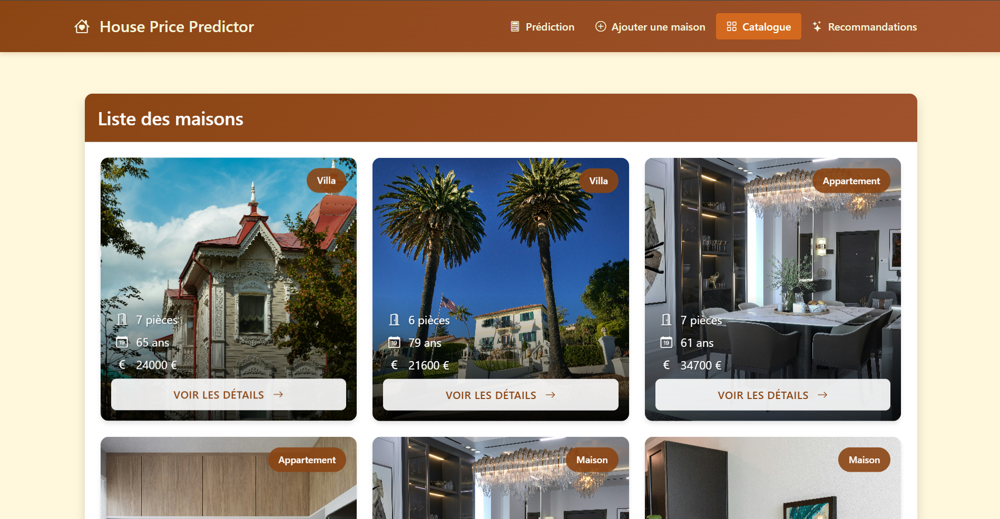
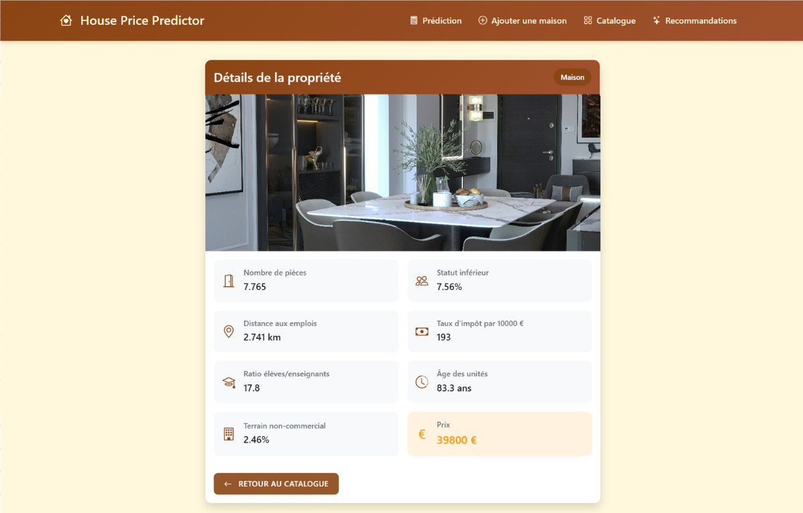

# House App - Application de Gestion Immobilière

## Sommaire
1. [Introduction](#introduction)
2. [Cahier des charges](#cahier-des-charges)
3. [Architecture de l'application](#architecture-de-lapplication)
4. [Réalisation technique](#réalisation-technique)
5. [Captures d'écran](#captures-décran)
6. [Bonnes pratiques et conventions](#bonnes-pratiques-et-conventions)
7. [Conclusion](#conclusion)

## 1. Introduction

### 1.1 Objectif du projet
House App est une application web moderne de gestion immobilière permettant aux utilisateurs de consulter, créer et gérer des propriétés immobilières. L'application offre des fonctionnalités avancées de prédiction de prix et de recommandations basées sur des critères spécifiques.

### 1.2 Contexte
- **Frontend** : Application Angular moderne avec une interface utilisateur intuitive
- **Backend** : API RESTful développée en Python (FastAPI) fournissant des services de prédiction de prix et de gestion des données immobilières

### 1.3 Technologies utilisées
- **Framework** : Angular 19
- **Langage** : TypeScript
- **Styling** : Bootstrap 5 + CSS personnalisé
- **État** : Services Angular
- **Routing** : Angular Router
- **HTTP Client** : Angular HttpClient

## 2. Cahier des charges

### 2.1 Besoins fonctionnels
1. **Gestion des propriétés**
   - Consultation de la liste des propriétés
   - Affichage détaillé d'une propriété
   - Création de nouvelles propriétés
   - Visualisation des caractéristiques détaillées

2. **Prédiction et recommandations**
   - Prédiction du prix d'une propriété
   - Recommandations de propriétés similaires
   - Filtrage et tri des résultats

3. **Interface utilisateur**
   - Navigation intuitive entre les pages
   - Formulaires de saisie avec validation
   - Affichage responsive des données
   - Gestion des erreurs et feedback utilisateur

### 2.2 Besoins non-fonctionnels
1. **Performance**
   - Temps de chargement optimisé
   - Gestion efficace des images
   - Mise en cache des données

2. **Responsive Design**
   - Adaptation à tous les écrans
   - Composants réactifs

3. **UX/UI**
   - Design moderne et épuré
   - Animations fluides
   - Feedback visuel des actions
   - Messages d'erreur clairs
   - Adaptabilité à différentes tailles d'écran   

## 3. Architecture de l'application

### 3.1 Structure des dossiers
```
src/
├── app/
│   ├── components/
│   │   ├── home/
│   │   ├── house-create/
│   │   ├── house-detail/
│   │   ├── house-list/
│   │   ├── predict-form/
│   │   └── recommendation-list/
│   ├── services/
│   │   └── house.service.ts
│   ├── interfaces/
│   │   └── house.interface.ts
│   └── app.routes.ts
└── assets/
    └── images/
```

### 3.2 Technologies utilisées
- **Angular 19** : Framework principal
- **TypeScript** : Langage de programmation
- **Bootstrap 5** : Framework CSS
- **Angular Router** : Gestion des routes
- **Angular Forms** : Gestion des formulaires
- **Angular HttpClient** : Communication avec l'API

### 3.3 Diagrammes
1. **Architecture des composants**
```
AppComponent
├── HomeComponent
├── HouseListComponent
├── HouseDetailComponent
├── HouseCreateComponent
├── PredictFormComponent
└── RecommendationListComponent
```

2. **Flux de navigation**
```
Home
├── House List
│   └── House Detail
├── Create House
├── Predict Price
└── Recommendations
    └── House Detail
```

## 4. Réalisation technique

### 4.1 Étapes de développement
1. **Initialisation**
   - Configuration du projet Angular
   - Mise en place de l'architecture
   - Configuration des routes

2. **Développement des composants**
   - Création des interfaces
   - Implémentation des services
   - Développement des composants UI

3. **Intégration API**
   - Connexion au backend
   - Gestion des requêtes HTTP
   - Gestion des erreurs

4. **UI/UX**
   - Implémentation du design
   - Responsive design
   - Animations et transitions

### 4.2 Défis rencontrés et solutions
1. **Gestion des images**
   - Défi : Optimisation du chargement des images
   - Solution : Implémentation d'un système de cache avec localStorage

2. **Cohérence des données**
   - Défi : Maintien de la cohérence entre les vues
   - Solution : Utilisation de services partagés et localStorage

3. **Performance**
   - Défi : Optimisation du chargement des listes
   - Solution : Pagination et lazy loading

## 5. Captures d'écran

### 5.1 Page d'accueil

*Interface principale de l'application*

### 5.2 Liste des propriétés

*Catalogue des propriétés immobilières*

### 5.3 Détails d'une propriété

*Vue détaillée d'une propriété*

### 5.4 Création d'une propriété

*Formulaire de création d'une nouvelle propriété*

### 5.5 Prédiction de prix

*Interface de prédiction du prix d'une propriété*

### 5.6 Recommandations

*Système de recommandations de propriétés*

## 6. Bonnes pratiques et conventions

### 6.1 Arborescence
- Organisation modulaire des composants
- Séparation claire des responsabilités
- Structure de dossiers intuitive

### 6.2 Nommage
- Convention de nommage cohérente
- Noms descriptifs pour les composants
- Préfixes clairs pour les interfaces

### 6.3 Code
- Utilisation de TypeScript strict
- Documentation du code
- Gestion des erreurs
- Tests unitaires

### 6.4 Outils
- ESLint pour le linting
- Prettier pour le formatage
- Git pour le versioning

## 7. Conclusion
House App est une application moderne et robuste qui répond aux besoins de gestion immobilière. L'architecture modulaire et les bonnes pratiques de développement permettent une maintenance facile et des évolutions futures. L'application offre une expérience utilisateur fluide et intuitive, tout en maintenant des performances optimales.
