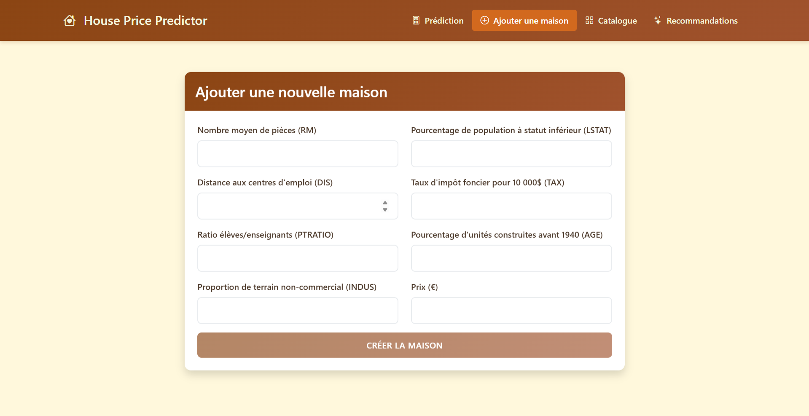

# House App - Complete Real Estate Management System

## Table of Contents
1. [Introduction](#introduction)
2. [Frontend - Angular Application](#frontend-angular-application)
3. [Backend - Boston Housing API](#backend-boston-housing-api)
4. [System Integration](#system-integration)
5. [Conclusion](#conclusion)

## 1. Introduction

House App is a comprehensive real estate management system that combines a modern Angular frontend with a powerful Python FastAPI backend. The application provides advanced property management capabilities, including browsing properties, creating new listings, price prediction using machine learning, and intelligent property recommendations.

### 1.1 System Overview
- **Frontend**: Modern Angular 19 application with intuitive user interface
- **Backend**: RESTful API developed in Python (FastAPI) with ML-powered price prediction
- **Database**: SQLite for data persistence
- **Machine Learning**: Scikit-learn for housing price prediction and recommendations

### 1.2 Key Features
- Property browsing and management
- Real-time price prediction using machine learning
- Property recommendations based on price similarity
- Responsive design for all devices
- RESTful API with automatic documentation

## 2. Frontend - Angular Application

### 2.1 Project Objective
The frontend is a modern web application for real estate management that allows users to browse, create, and manage real estate properties with advanced price prediction features and recommendations.

### 2.2 Technologies Used
- **Framework**: Angular 19
- **Language**: TypeScript
- **Styling**: Bootstrap 5 + Custom CSS
- **State Management**: Angular Services
- **Routing**: Angular Router
- **HTTP Client**: Angular HttpClient

### 2.3 Requirements Specification

#### 2.3.1 Functional Requirements
1. **Property Management**
   - Browse property listings
   - Display detailed property information
   - Create new properties
   - View detailed characteristics

2. **Prediction and Recommendations**
   - Property price prediction
   - Similar property recommendations
   - Result filtering and sorting

3. **User Interface**
   - Intuitive navigation between pages
   - Input forms with validation
   - Responsive data display
   - Error handling and user feedback

#### 2.3.2 Non-Functional Requirements
1. **Performance**
   - Optimized loading times
   - Efficient image management
   - Data caching

2. **Responsive Design**
   - Adaptation to all screen sizes
   - Responsive components

3. **UX/UI**
   - Modern and clean design
   - Smooth animations
   - Visual action feedback
   - Clear error messages
   - Adaptability to different screen sizes

### 2.4 Application Architecture

#### 2.4.1 Folder Structure
```
src/
├── app/
│   ├── components/
│   │   ├── home/
│   │   ├── house-create/
│   │   ├── house-detail/
│   │   ├── house-list/
│   │   ├── predict-form/
│   │   └── recommendation-list/
│   ├── services/
│   │   └── house.service.ts
│   ├── interfaces/
│   │   └── house.interface.ts
│   └── app.routes.ts
└── assets/
    └── images/
```

#### 2.4.2 Component Architecture
```
AppComponent
├── HomeComponent
├── HouseListComponent
├── HouseDetailComponent
├── HouseCreateComponent
├── PredictFormComponent
└── RecommendationListComponent
```

#### 2.4.3 Navigation Flow
```
Home
├── House List
│   └── House Detail
├── Create House
├── Predict Price
└── Recommendations
    └── House Detail
```

### 2.5 Technical Implementation

#### 2.5.1 Development Steps
1. **Initialization**
   - Angular project configuration
   - Architecture setup
   - Route configuration

2. **Component Development**
   - Interface creation
   - Service implementation
   - UI component development

3. **API Integration**
   - Backend connection
   - HTTP request management
   - Error handling

4. **UI/UX**
   - Design implementation
   - Responsive design
   - Animations and transitions

#### 2.5.2 Challenges Encountered and Solutions
1. **Image Management**
   - Challenge: Optimizing image loading
   - Solution: Implementation of a caching system with localStorage

2. **Data Consistency**
   - Challenge: Maintaining consistency between views
   - Solution: Using shared services and localStorage

3. **Performance**
   - Challenge: Optimizing list loading
   - Solution: Pagination and lazy loading

### 2.6 Screenshots

#### 2.6.1 Home Page

*Main application interface*

#### 2.6.2 Property List

*Real estate property catalog*

#### 2.6.3 Property Details

*Detailed view of a property*

#### 2.6.4 Property Creation

*Form for creating a new property*

#### 2.6.5 Price Prediction

*Property price prediction interface*

#### 2.6.6 Recommendations

*Property recommendation system*

## 3. Backend - Boston Housing API

### 3.1 Introduction

The backend is a Boston Housing Predictor API, a web service that predicts housing prices based on the Boston Housing dataset. The project integrates machine learning with a web API framework to provide real-time housing price predictions and recommendations.

The application is built using FastAPI as the web framework, SQLite for data persistence, and scikit-learn for the machine learning capabilities. The API exposes endpoints for creating new housing entries, retrieving housing data, making price predictions, and receiving housing recommendations based on target prices.

Key features of the Boston Housing API include:
- Data storage and retrieval for Boston housing information
- ML-powered price prediction from housing attributes
- House recommendation system based on price similarity
- RESTful API interface with automatic documentation

### 3.2 Regression Model

#### 3.2.1 Dataset Overview

The project uses the Boston Housing dataset, a well-known dataset in machine learning containing information about housing in various suburbs of Boston. The dataset includes the following features used in our implementation:

- `rm`: Average number of rooms per dwelling
- `lstat`: Percentage of lower status population
- `dis`: Weighted distances to employment centers
- `tax`: Property tax rate
- `ptratio`: Pupil-teacher ratio
- `age`: Proportion of owner-occupied units built prior to 1940
- `indus`: Proportion of non-retail business acres per town
- `medv`: Median value of owner-occupied homes in $1000s (target variable)

#### 3.2.2 Model Development

The machine learning model was developed using scikit-learn's pipeline architecture, which combines preprocessing steps with the regression algorithm. The pipeline includes:

1. **Data Splitting**: The dataset was split into training (80%) and testing (20%) sets.
2. **Feature Engineering**: The pipeline includes:
   - Feature scaling using StandardScaler
   - Polynomial feature generation (degree=2) to capture non-linear relationships
3. **Regression Model**: Ridge Regression with alpha=10 to prevent overfitting

```python
# Build a pipeline: scaling -> polynomial features -> ridge regression
alp = 10
pipeline = Pipeline([
    ('scaler', StandardScaler()),
    ('poly', PolynomialFeatures(degree=2, include_bias=False)),
    ('model', Ridge(alpha=alp))
])
```

#### 3.2.3 Model Performance

The model achieved significantly better performance than baseline approaches:

| Metric | Baseline Model | Improved Model |
|--------|--------------|---------------|
| R² Score | 0.639 | 0.821 |
| MAPE | 18.0% | 12.2% |
| RMSE | N/A | 3.618 k$ |

With a Mean Absolute Percentage Error (MAPE) of 12.2%, the model achieves a regression accuracy of 87.8%, making it reliable for housing price predictions.

#### 3.2.4 Model Deployment

The trained pipeline was serialized using joblib and saved as `pipeline.pkl` for use in the FastAPI application:

```python
with open('pipeline.pkl', 'wb') as f:
    pickle.dump(pipeline, f, protocol=pickle.HIGHEST_PROTOCOL)
```

### 3.3 UML Diagrams

#### 3.3.1 Class Diagram

Based on the project's implementation, the following class diagram represents the core components of the Boston Housing API:


This diagram shows the core components of the application:
- Data models (SQLAlchemy and Pydantic)
- API controllers (FastAPI routes)
- ML prediction model
- Database dependency

#### 3.3.2 Sequence Diagram for Price Prediction


#### 3.3.3 Sequence Diagram for House Recommendation


### 3.4 FastAPI Technology and Built-in Functionality

#### 3.4.1 FastAPI Overview

FastAPI is a modern, high-performance web framework for building APIs with Python based on standard Python type hints. Key advantages that made it suitable for this project include:

1. **Performance**: FastAPI is built on Starlette and Pydantic, making it one of the fastest Python frameworks available.
2. **Automatic Documentation**: FastAPI generates interactive API documentation (Swagger UI and ReDoc) automatically.
3. **Data Validation**: Using Pydantic models, FastAPI validates request data automatically.
4. **Dependency Injection**: The framework provides a clean way to inject dependencies like database sessions.
5. **Modern Python Features**: FastAPI leverages Python 3.6+ features including type hints and async/await.

#### 3.4.2 Key FastAPI Features Used in the Project

##### Pydantic Models for Data Validation

The project uses Pydantic models to validate incoming request data and define response schemas:

```python
class HomeBase(BaseModel):
    rm: float
    lstat: float
    dis: float
    tax: float
    ptratio: float
    age: float
    indus: float

class HomeCreate(HomeBase):
    medv: float  # Include actual median value when creating

class HomeOut(HomeBase):
    id: int
    medv: float
    class Config:
        orm_mode = True
```

##### Dependency Injection

The project uses FastAPI's dependency injection system to manage database sessions:

```python
def get_db():
    db = SessionLocal()
    try:
        yield db
    finally:
        db.close()
```

##### Path Operations (Route Handlers)

The API exposes several endpoints defined as path operation functions:

```python
@app.get("/homes/", response_model=list[HomeOut])
def list_homes(skip: int = 0, limit: int = 100, db: Session = Depends(get_db)):
    return db.query(Home).offset(skip).limit(limit).all()
```

##### Automatic Documentation

FastAPI automatically generates interactive API documentation using Swagger UI and ReDoc:

- Swagger UI available at `/docs`
- ReDoc available at `/redoc`

This documentation includes:
- Request and response schemas
- Example request bodies
- Available query parameters
- HTTP status codes
- Authentication requirements (if any)

### 3.5 Database and API Endpoints

#### 3.5.1 Database Structure

The application uses SQLite database with SQLAlchemy as the ORM. The database consists of a single table:

**Table: homes**

| Column | Type | Description |
|--------|------|-------------|
| id | Integer | Primary key |
| rm | Float | Average number of rooms |
| lstat | Float | % lower status of the population |
| dis | Float | Weighted distances to employment centers |
| tax | Float | Property tax rate |
| ptratio | Float | Pupil-teacher ratio |
| age | Float | Proportion of owner-occupied units built prior to 1940 |
| indus | Float | Proportion of non-retail business acres |
| medv | Float | Median value in $1000s |

#### 3.5.2 API Endpoints

The API exposes the following endpoints:

##### Root Endpoint

```
GET /
```

**Description**: Returns a welcome message.  
**Response**:
```json
{
  "message": "Welcome to the Boston Housing Predictor API"
}
```

##### Create Home

```
POST /homes/
```

**Description**: Creates a new home entry in the database.  
**Request Body**:
```json
{
  "rm": 6.5,
  "lstat": 4.98,
  "dis": 6.0,
  "tax": 296,
  "ptratio": 15.3,
  "age": 65.2,
  "indus": 2.31,
  "medv": 24.0
}
```
**Response**: The created home object with its ID.

##### List Homes

```
GET /homes/
```

**Description**: Returns a list of homes from the database.  
**Query Parameters**:
- `skip` (int, default: 0): Number of records to skip
- `limit` (int, default: 100): Maximum number of records to return
**Response**: Array of home objects.

##### Predict Price

```
POST /predict/
```

**Description**: Predicts the price of a home based on its features.  
**Request Body**:
```json
{
  "rm": 6.5,
  "lstat": 4.98,
  "dis": 6.0,
  "tax": 296,
  "ptratio": 15.3,
  "age": 65.2,
  "indus": 2.31
}
```
**Response**:
```json
{
  "predicted_price_dh": 259600.0
}
```
Note: The response is in dirhams (original prediction in $1000s * 1000 * 10).

##### Get Recommendations

```
GET /recommendation/
```

**Description**: Returns homes with values closest to the specified price.  
**Query Parameters**:
- `price` (float): Target price in dirhams
- `limit` (int, default: 20): Maximum number of recommendations
**Response**: Array of home objects ordered by price similarity.

#### 3.5.3 Request and Response Flow

For each API endpoint, the request and response flow follows this pattern:

1. **Request Validation**: FastAPI validates incoming requests against Pydantic models
2. **Database Interaction**: The API interacts with the SQLite database via SQLAlchemy ORM
3. **Model Prediction** (for `/predict/`): The API uses the loaded scikit-learn model
4. **Response Serialization**: FastAPI serializes the response using Pydantic models

### 3.6 Project Structure

The backend project is organized with the following structure:

```
boston-housing-api/
├── homes.db               # SQLite database
├── load_data.py           # Script to load data from CSV to database
├── main.py                # FastAPI application
├── pipeline.pkl           # Serialized ML model
├── README.md              # Project documentation
└── requirements.txt       # Project dependencies
```

### Component Description:

- **homes.db**: SQLite database storing the Boston housing data
- **load_data.py**: Script that downloads the Boston housing dataset, filters required columns, and inserts records into the database
- **main.py**: Main FastAPI application defining models, routes, and API logic
- **pipeline.pkl**: Serialized scikit-learn pipeline containing preprocessing steps and Ridge regression model
- **requirements.txt**: Project dependencies for easy installation

## 4. System Integration

### 4.1 Frontend-Backend Communication

The Angular frontend communicates with the FastAPI backend through HTTP requests using Angular's HttpClient. The integration points include:

1. **Property Management**: Frontend components interact with `/homes/` endpoints to create and retrieve property data
2. **Price Prediction**: The predict form component sends property features to `/predict/` endpoint and displays the predicted price
3. **Recommendations**: The recommendation component queries `/recommendation/` endpoint based on user-specified price ranges

### 4.2 Data Flow

The complete data flow in the system follows this pattern:

1. **User Interaction**: Users interact with Angular components
2. **HTTP Requests**: Angular services make HTTP requests to FastAPI endpoints
3. **Data Processing**: FastAPI processes requests, potentially using ML models or database queries
4. **Response Handling**: Angular components receive and display the processed data

### 4.3 Technology Stack Summary

| Layer | Technology | Purpose |
|-------|------------|---------|
| Frontend | Angular 19 + TypeScript | User interface and interaction |
| Backend API | FastAPI + Python | RESTful API and business logic |
| Machine Learning | Scikit-learn | Price prediction and recommendations |
| Database | SQLite + SQLAlchemy | Data persistence |
| Styling | Bootstrap 5 | Responsive design |

## 5. Conclusion

The House App represents a comprehensive real estate management system that successfully integrates modern web technologies with machine learning capabilities. The combination of Angular frontend and FastAPI backend creates a powerful, efficient, and user-friendly solution for property management and price prediction.

### 5.1 Key Achievements

**Frontend Achievements:**
- Modern and intuitive user interface built with Angular 19
- Responsive design that works across all device sizes
- Efficient state management and data caching
- Smooth user experience with proper error handling

**Backend Achievements:**
- High-performance regression model with 87.8% accuracy
- RESTful API with automatic documentation
- Robust data validation and error handling
- Efficient recommendation system based on price similarity

**System Integration:**
- Seamless communication between frontend and backend
- Real-time price predictions and recommendations
- Comprehensive property management capabilities
- Scalable architecture for future enhancements

### 5.2 Future Enhancements

The modular architecture and development best practices enable easy maintenance and future evolution. Potential enhancements could include:
- Advanced search and filtering capabilities
- User authentication and authorization
- Real-time data updates
- Integration with external real estate APIs
- Mobile application development

The House App successfully meets modern real estate management needs while providing a solid foundation for continued development and enhancement.
